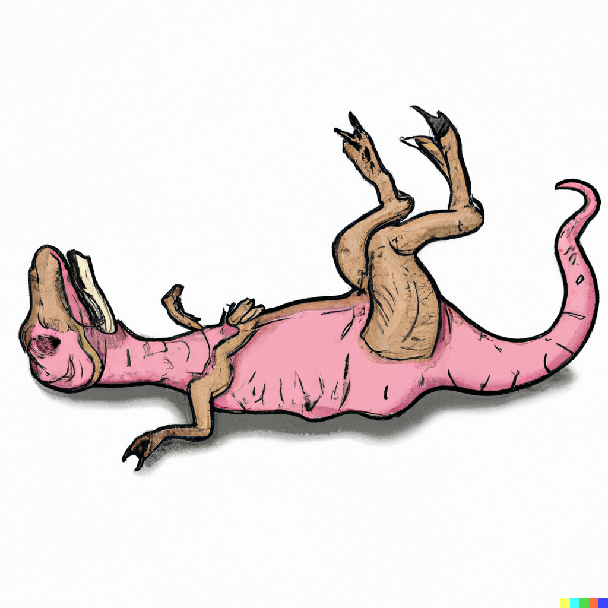
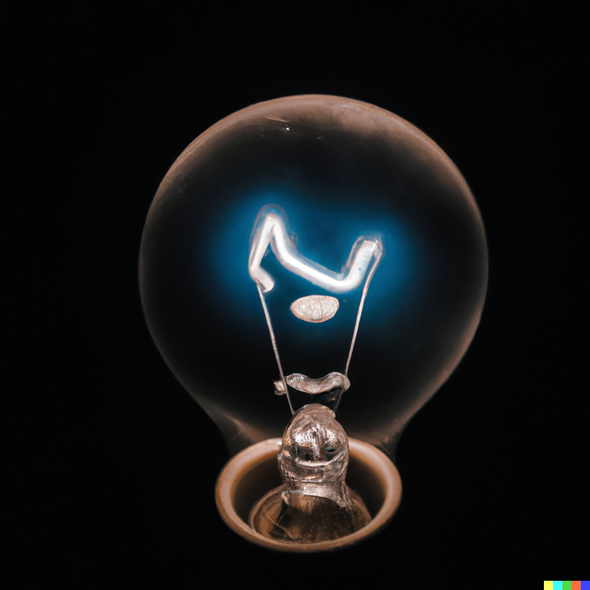
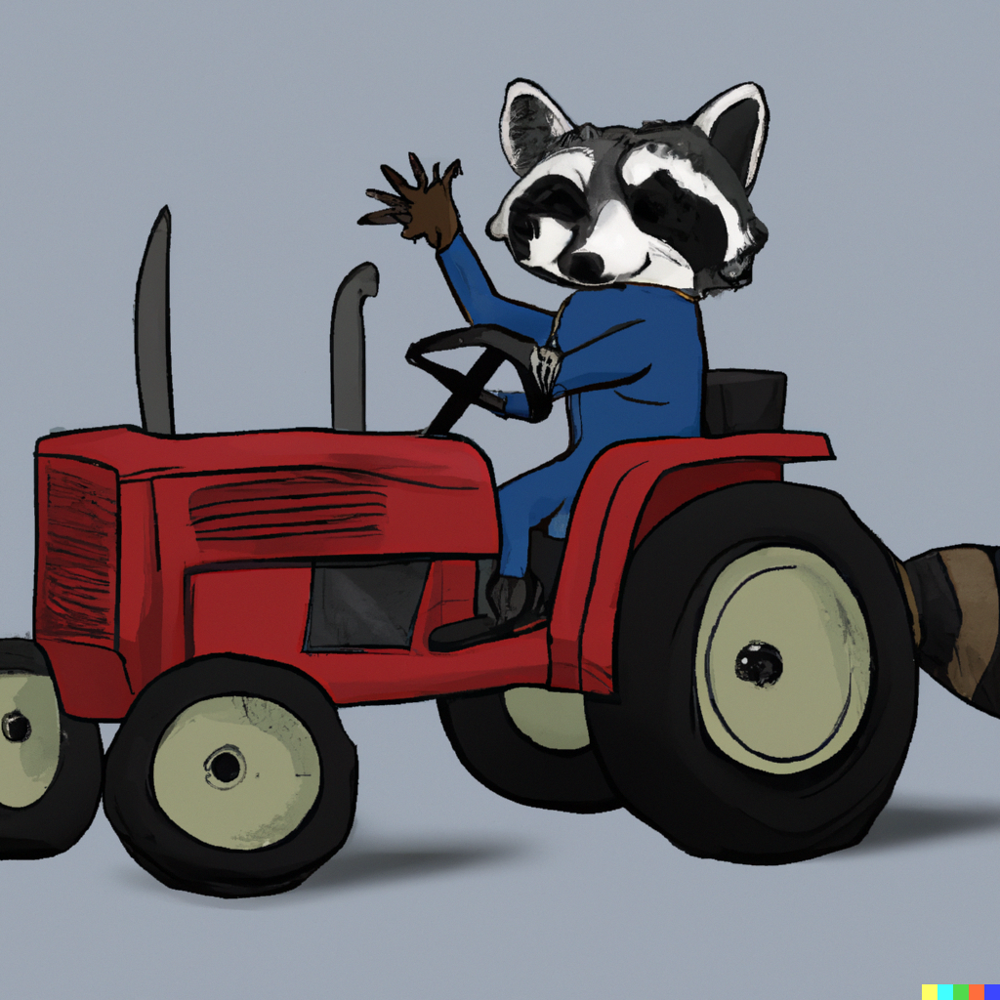
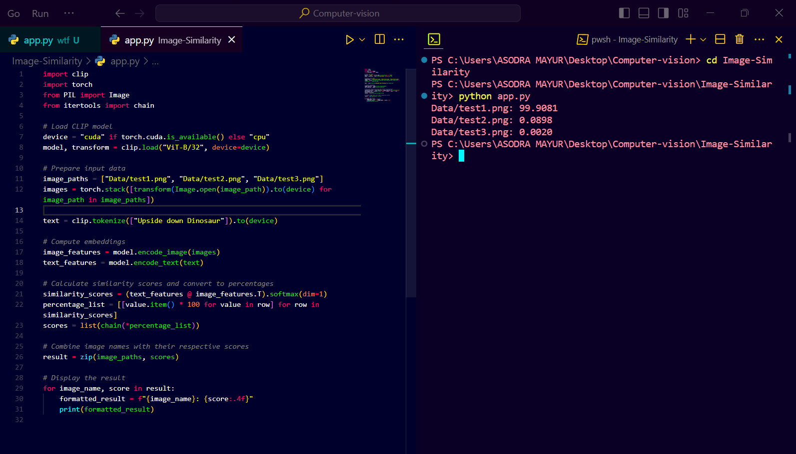

**Few Snapshot to Increase Curiosity🤔**

  
  
  
  

**Explanation:**

1. **Loading the CLIP Model 🚀:**

   - We start by summoning the CLIP model, a magical entity capable of understanding both images and text. We equip it with the powerful "ViT-B/32" vision transformer to aid in its quest.

2. **Preparing Input Data 🎨:**

   - Our brave adventurers, represented by a collection of image paths, embark on a journey. We transform these paths into images, ready to be processed by our model.

3. **Computing Embeddings 🤖:**

   - The images and text are transformed into numerical representations, or embeddings, using the CLIP model's enchantments. These embeddings capture the essence of the images and the essence of the text.

4. **Calculating Similarity Scores and Converting to Percentages 📊:**

   - Through the magic of matrix multiplication and softmax incantations, we calculate the similarity scores between the text and each image. These scores are then transformed into percentages, making them easier for mere mortals to comprehend.

5. **Combining Image Names with Scores 🎭:**

   - We weave a tapestry of image names and their corresponding similarity scores, creating a symphony of data ready to be unveiled.

6. **Displaying the Result 🖼️:**
   - With a flourish of our code wands, we reveal the results of our journey. Each image's name is accompanied by its likeness score, allowing us to marvel at the connections between images and text.

And thus concludes our adventure through the realms of code and creativity! 🌟🎩📸
